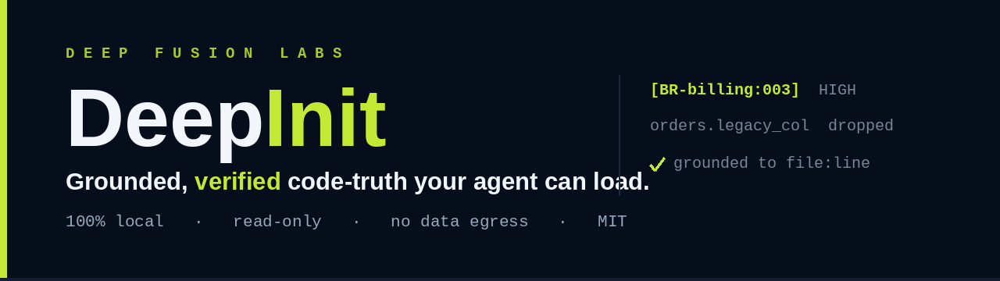

<!-- DEEPINIT:HUMAN-AUTHORED — not a DeepInit-managed region -->
<p align="center">
  
</p>

<p align="center">
  
  
  
  
  
</p>

<h1 align="center">DeepInit</h1>

<p align="center"><b>Your coding agent reads every file — and still breaks rules that were never written down anywhere.</b></p>

It rewrites a function with total confidence, then violates a business rule no comment mentions. It trusts your schema file when the live database already dropped that column. It changes one service and breaks another through a table it never knew they shared. It "cleans up" a workaround that was load-bearing.

DeepInit reads your codebase and **writes down the truth** — the real rules, the live database, the *why*, and the problems it finds — with **every claim grounded to a `file:line` and checked against your code before it's written.**

> **The difference in one line:** most tools hand your whole repo to an LLM and hope. DeepInit **parses** your code first (real AST parsing via Graphify, 25 languages, with graceful grep fallback), reasons on top, then **verifies every finding against the code** before writing it down. A prompt gives you one ungrounded guess; DeepInit grounds every claim and measures its own false-alarm rate.

100% local · read-only · no servers, no data egress · MIT.

**Full walkthrough, live examples & the evidence → [deepfusionlabs.ai/deepinit](https://deepfusionlabs.ai/deepinit)**

---

## Quickstart

DeepInit ships as a **Claude Code plugin** — install it once, then run `/deep-init` in any project. These are slash commands you type into the Claude Code chat (not your terminal):

```
/plugin marketplace add deepfusionlabs/deep-init
/plugin install deep-init@deepfusionlabs-deep-init
# then /reload-plugins  (a window reload isn't enough; in VS Code / JetBrains, restart the IDE)
/deep-init
```

That's the whole getting-started. A bare `/deep-init` uses **strong defaults** — deepest analysis, adaptive review (2 adversarial cycles, plus a 3rd automatically when the analysis isn't yet clean), issue detection + report + SARIF all on. It's non-blocking: it detects your stack, shows one panel, and proceeds. Update later with `/deep-init:plugin-update`.

It writes, under your repo:

```
CLAUDE.md             # lean, always-loaded brief — Claude Code auto-loads it (your content preserved byte-for-byte, with a dated .bak)
.ai/docs/             # the deep, on-demand layer + the issue ledger
.ai/report.html       # ONE offline report — Docs · Insights · Map: browsable docs, the issue/metrics dashboard, and an interactive component-graph view (⌘K, jump-to-file:line); /deep-init:translate → report.<lang>.html (Spanish built in, any other language on demand)
.ai/deepinit.sarif    # SARIF v2.1.0 — shows up in GitHub code scanning / your IDE
```

`CLAUDE.md` is the canonical front door — Claude Code auto-loads it and does **not** read `AGENTS.md` natively, so DeepInit owns `CLAUDE.md` directly (it's the grounded replacement for `/init`). Also working in Cursor, Copilot, or Windsurf? DeepInit additionally emits a matching lean `AGENTS.md` + per-tool rule files — but **only when it detects one of those tools**, so a Claude-Code repo isn't littered with a redundant `AGENTS.md`.

**Run it the moment an agent needs to understand a codebase it didn't write** — you inherited a legacy repo, you're onboarding an agent to a large project, or you're about to refactor something load-bearing.

Turn it down with `/deep-init:fast`, refresh only what changed with `/deep-init:refresh`, or check staleness for free (0 tokens) with `/deep-init:check`. Prefer buttons? `/deep-init:customize`. Localize the report with `/deep-init:translate`. Full command surface: [`skills/deep-init/SKILL.md`](skills/deep-init/SKILL.md).

**Prerequisites:** only [`scc`](https://github.com/boyter/scc) (sizing) is required. [Graphify](https://github.com/safishamsi/graphify) (`pip install graphifyy`, no API key for AST extraction) is recommended for richer structural analysis. `ctags`, `gitleaks`/`trufflehog`, and a DB client are optional. **Everything degrades gracefully — one missing tool never aborts a run.**

---

## What you get

**One engine, two outputs you can actually trust** — plus the problems it finds along the way.

- **Lean, always-loaded** — `CLAUDE.md` (~100 lines), the file Claude Code auto-loads: only the highest-value facts your agent **couldn't already figure out for itself.** Kept small on purpose, so the few things that matter aren't buried. (Piling everything into a giant `CLAUDE.md` makes agents do *worse*, not better — a 2026 ETH Zurich study measured lower task success and 20%+ more cost, because the things that matter get lost in the noise.)
- **Deep, on-demand** — `.ai/docs/`: per-component analysis, five whole-system docs, decisions (ADRs) + a knowledge log, live DB schema + ORM drift.
- **The problems layer** — a report-only issue ledger (`issues.md`), **10 detector families** plus a class-conformance census, every finding grounded to the line and framed as *likely* rather than asserted. **It never edits your source, and never enters the lean tier.**
- **Outputs you can act on** — one self-contained, offline `report.html` — **Docs · Insights · Map** in a single file: browsable docs, the issue/metrics dashboard, and an interactive **Map** of the component graph DeepInit already computes (a visual for *you*, the human — your agent's answer is already in the files, not somewhere it has to go query). `/deep-init:translate` localizes it — Spanish built in, any other language on demand — and a **SARIF v2.1.0** export appears in GitHub code scanning and your IDE. (The legacy `docs-viewer.html` / `dashboard.html` are now redirect stubs.)

### What it actually writes down

```
## Business rules — billing  (per component)
[BR-billing:003] CORE — An invoice can't be voided once its payment has settled;
            void attempts must go through the refund flow instead.
            from  src/billing/invoice.ts:142                    ✓ checked · HIGH

## Database vs. code — orders
⚠  orders.legacy_status (text) is still read by the reporting job, but your
            Prisma schema dropped it — an agent trusting the schema will miss it.
            from  prisma/schema.prisma:88  ↔  src/orders/order.ts:24      ✓ checked

## Use case — across components
[UC-014] Checkout → charge → fulfil: orders.create() calls billing.charge();
            a failure *after* the charge must call billing.refund() —
            orders can't roll the payment back itself.
            spans  orders/ · billing/ · fulfilment/                       ✓ checked
```

Every finding is typed, tagged by importance and confidence, points to the exact `file:line`, and is **checked against your code before it's written.**

---

## Stays current — re-documents only what changed

After the first run, `/deep-init:refresh` re-analyzes only an edit's **blast radius** (the touched components + anything whose *public interface* moved), never the whole repo:

1. **Detect** — a `content_hash` per component, diffed against the stored manifest by an authoritative **symmetric set-diff** (`git diff` is only an accelerator → deletions and no-git repos are still caught).
2. **Interface-hash skip** — a body-only refactor skips its dependents; only a changed export marks the transitive dependents dirty. A *reversible* cost optimization.
3. **Always re-run the 5 whole-system docs** — the safety net: a cross-component effect (a new circular dep, a shifted workflow) is invisible from one component's diff.
4. **Re-emit only the affected files** — inside owned-region markers, with a dated reversible backup; issues are diffed against a **symbol-keyed baseline** (new / persisting / resolved / regressed) so a line-shift never re-churns a finding.

**Two guarantees** close the ways docs silently rot: a real interface change **can never skip a dependent** that needed it (the grep path reconciles `export *` / `module.exports` / `__all__` against export-indicator tokens), and a removed or moved file **never leaves an orphaned doc** (the symmetric diff catches it, even with no git history).

**Freshness is honest, opt-in, and 0-token.** Two plugin-shipped hooks call the same no-LLM status script — one on **session start** and one on your **first prompt of a stale session** (so drift that appears mid-session, e.g. right after a commit, is still caught). They share **one once-per-session gate**, so you're offered a refresh **at most once** — and the offer **shows what changed** (the drifted files, not just a count), as a one-click *Update now* / *Not now* / *Don't ask in this repo*. A real headless auto-refresh exists but is **off by default** (the only level that spends tokens). **None auto-commit — you always review the diff.** A git hook can't summon an AI session, so DeepInit doesn't pretend your docs regenerate on every commit. The 0-token staleness + broken-citation audit (CI-friendly): `/deep-init:check`.

---

## Why trust it

The trust-killer for a tool like this is the false positive, so detection biases hard toward suppression. **Every number we publish is DeepInit's own**, never a vendor's, and self-derives from committed `repo@SHA`-pinned records under [`validation/`](validation/).

**Headline — own fixtures, blind run: recall 9/9 (100%), false-positives 0.**

Beyond that, the evidence is **INDICATIVE** and framed as comprehension/agreement — not "finds bugs in famous repos":

- **It never re-flags a line a human already fixed.** Against an independent oracle of **22 real merged-bugfix pairs** (the metamorphic method — 4 languages, including 3 CVEs): recall **14/22 (64%, Wilson95 lower-bound 43%)** with **0/22 metamorphic false-positives.** Recall is reported-not-gated (small-n, real-repo); the make-or-break gate is the **0 metamorphic-FP.** → [`validation/`](validation/)
- **The Mirror Test — does it actually understand your architecture?** We removed projects' own architecture docs, ran DeepInit on the code alone, and checked what it re-derived. Across **8 held-out repos**: faithfulness **98%**, **zero confidently-wrong claims**, coverage **66%** (strong on structure, weaker on deep invariants). The contamination answer: on 2 obscure repos a model is very unlikely to have memorized (one Go, one Rust) **faithfulness held at 100%** — so what it states about *unfamiliar* code is just as trustworthy; coverage varies with how deep one pass goes, not with trustworthiness. → [`validation/coverage/`](validation/coverage/)
- **Real end-to-end runs** (the actual multi-component pipeline on excalidraw + kagent): faithfulness **100% on both**, **zero confidently-wrong facts**, ~130 grounded facts each. → [`validation/end-to-end/`](validation/end-to-end/)
- **Real-repo precision** (4 multi-stack repos with documented rules): **~90 naive false-positives avoided, 0 false defects.** → [`validation/`](validation/)

**It writes the truth down — the rest build something to query.** Wikis, code graphs, and index tools give you a separate place to go ask questions, only as current as their last crawl. DeepInit writes verified markdown straight into the files your agent already loads.

---

## Tested like production software

This isn't a weekend skill. **This is the harness — not the model.** A prompt hands you one ungrounded guess; the harness grounds every claim, measures its own false-alarm rate, and is regression-tested on every change.

- **443 deterministic checks** (no model) across **99 oracle sections** that must stay all-PASS.
- A **mutation meta-harness** proves every one of those checks is load-bearing — not vacuous green.
- The whole suite **stays green WITHOUT the held-out answer keys**, so the proof ships public while the keys stay private.
- **CI runs it all on every change.**
- **Run at the right depth** — the suite is tiered, so a typo fix doesn't pay for a release-grade sweep: **L0 smoke** (seconds, every edit) · **L1 gate** (only the mutations whose files changed) · **L2 full** (the whole mutation sweep + drift + public-harness, every release) · **L3 deep** (metered real-engine, only when the engine's output could actually move).

Run it yourself:

```
PYTHONUTF8=1 python tests-fixtures-v1/_chat_validation.py    # the harness
make validate                                                # every gate, one command
```

`make validate` runs the harness + the stats/count-drift guards + the mutation meta-harness + the public-harness check. No LLM, no real skill run. `PYTHONUTF8=1` is recommended on Windows. Contributing? See [`CONTRIBUTING.md`](CONTRIBUTING.md).

**Breadth:** a **16-repo / 13-language / 3-size matrix** ([`validation/matrix/`](validation/matrix/)) plus **15 cross-language field sweeps** (~1.12M LOC, [`validation/recall-discovery/`](validation/recall-discovery/)). **15 of 16 parse on the designed AST path** (only Crystal lacks a grammar → graceful grep fallback, which is exactly why kemal is our end-to-end degradation proof).

**Real understanding beats "just ask an LLM."** Run three ways and scored against the AST as ground truth, DeepInit's full path grounds **98.9%** of its claims to a verified `file:line` (grep-fallback 100%); a naive LLM-only baseline grounds just **43.5%** (0% on one repo) and missed every grounded security-relevant finding. → [`validation/matrix/UNDERSTANDING-MATTERS.md`](validation/matrix/UNDERSTANDING-MATTERS.md)

**We use it on our own code** — run over our own tooling, an independent internal reviewer's verdict was **WOULD-USE** (every "Critical to know" fact dual-grounded to a real `file:line`, all hard counts exact).

Every published figure self-derives from [`validation/STATS.json`](validation/STATS.json) (a CI drift-gate fails on a stale number). Corrections to any INDICATIVE figure are logged in [`docs/HISTORY.md`](docs/HISTORY.md).

---

## Issue families

**Core families** (always on):

| Family | What it finds |
|--------|---------------|
| IF-1 | Unenforced / inconsistent **business rules** (incl. an access-control check a sibling path has but this one is missing — surfaced as a rule violation, not a security claim) |
| IF-2 | **DB-vs-code drift** — an ORM model disagreeing with the live schema |
| IF-3a | **Silent cross-component coupling** — a shared table/global/queue mutated by ≥2 components with no interface between them |
| IF-4 | **Intent/decision contradictions** — code contradicting a recorded ADR, a load-bearing workaround, a name-lie |
| IF-5 | **Risk-hotspot ranking** — what to look at first (criticality-weighted, not churn-only) |

**Extended families** (all shipped, each gated on its own measured-FP exit-gate):

| Family | What it finds |
|--------|---------------|
| IF-3b | **Interface contract breach** — a named import absent from the exporter's public surface |
| IF-6 | **Divergent reimplementation** — the same named allowed-value set defined in ≥2 places with conflicting membership, so a value one component emits another rejects (fires where clone detectors go silent once copies diverge) |
| IF-7(a) | **Error-path contradicts a documented rule** — a failure path that does the opposite of a rule the project itself documents (the first net-new **semantic** family; dual-cited, certainty-capped) |
| IF-7(c) | **Cross-boundary swallowed error** — an empty handler in a function consumed across a component boundary |
| IF-8 | **Circular component dependency** — a strongly-connected import cycle |
| IF-10 | **Statically-dead branch** — an `if (FLAG)` arm where `FLAG` resolves to a compile-time constant, including across a module edge (lives in the gap ESLint's `no-constant-condition` leaves — it doesn't follow the const indirection) |

Plus a **class-conformance census overlay** — a non-detector that *enriches* an already-firing fire by counting how many siblings conform; it never raises an issue of its own.

---

## Scope & boundaries

- **Report-only.** No auto-fix of issues; `--heal` defaults to a dry-run `preview` and **never edits source.**
- **100% local.** No servers, no data egress. The skill itself defines no network tool.
- **SQL databases** for live IF-2 this release (NoSQL is stub-level — honestly labeled).
- DeepInit flags *likely* issues and verifies **existence + plausibility**, not correctness. This is not a security product.
- **Out of scope** (sibling tools own these): a dedicated graph-exploration / query product, dedicated security scanning, cross-model verification. *(The report's Map view is a visual of the graph DeepInit already computes — not a separate graph database to go query.)*

> **What this repo is:** DeepInit is a **Claude Code skill defined entirely in Markdown** — there is no application code. The "engine" is a Claude instance executing the instructions in [`skills/deep-init/`](skills/deep-init/). `skills/deep-init/SKILL.md` is the entry point; `skills/deep-init/references/*.md` are the stage specs, loaded on demand. Editing DeepInit means editing those instruction files.

**Cost** is **INDICATIVE only**: DeepInit runs in your own Claude Code session — the cost is the token cost of one analysis pass (no subscription, no API key for the parser). A small repo is an inexpensive single pass; cost tracks component count more than raw lines. We have **no published dollar figure yet** while we finish benchmarking. → [`validation/matrix/COST-MODEL.md`](validation/matrix/COST-MODEL.md)

---

## Layout

```
skills/deep-init/SKILL.md        # the skill entry point (command surface + run flow)
skills/deep-init/references/*.md # stage specs (detection, extraction, filter, redaction, verification, …)
skills/deep-init/assets/         # the dashboard & docs-viewer templates + the post-commit hook
tests-fixtures-v1/        # mini-repo fixtures + the deterministic validation harness
validation/               # per-repo, repo@SHA-pinned real-world evidence
docs/                     # the design corpus (spec, requirements, design, test plan, …)
```

## License

MIT © Deep Fusion Labs. See [`LICENSE`](LICENSE) and [`AI_POLICY.md`](AI_POLICY.md).
